# Founders Kit — Your AI Team in a Box

> 52 specialist AI agents + 9 team coordinators + 42 slash commands + hooks + MCP configs for Claude Code.
> One install. Your entire product, engineering, and business team — ready to ship.

[](https://opensource.org/licenses/MIT)
[](https://claude.ai/code)
[](#the-team--52-specialists)
[](#skills--25-slash-commands)
[](#routing-commands)



---

## What is this?

Instead of switching between AI tools, spinning up different ChatGPT conversations, or wondering which AI is best for your task — you get a full team of specialists that work together inside Claude Code.

**Type `/founder "build me a RAG-powered document search"` and get:**
- `ai-architect` designing the system
- `ai-engineer` implementing the embedding pipeline
- `ai-backend-engineer` building the API
- `ai-qa-engineer` setting up evals

All coordinated. All specialists. No context switching.

---

## One-Line Install

```bash
curl -fsSL https://raw.githubusercontent.com/VenkataAnilKumar/FoundryAI/main/install.sh | bash
```

Or manually:

```bash
git clone https://github.com/VenkataAnilKumar/FoundryAI

# Agents
cp FoundryAI/agents/*.md ~/.claude/agents/

# Skills (slash commands)
mkdir -p ~/.claude/commands
cp FoundryAI/skills/*.md ~/.claude/commands/

# Plugin (routing commands)
claude plugin add ./FoundryAI/plugin
```

---

## What's Included

| | Count | What |
|---|---|---|
| **Agents** | 52 + 9 teams | Specialist subagents across engineering, product, and business |
| **Skills** | 42 | Slash commands — `/review`, `/debug`, `/prd`, `/eval`, `/migrate`... |
| **Routing commands** | 4 | `/founder`, `/engineering`, `/product`, `/business` |
| **Project templates** | 4 | Stack-specific `CLAUDE.md` files for your project |
| **Workflow recipes** | 16 | Pre-built multi-agent team prompts |
| **Hooks** | 3 | Automated behaviors (logging, protection, notifications) |
| **MCP configs** | 3 | GitHub, PostgreSQL, full-stack server configs |

---

## The Team — 52 Specialists

### Leadership (5)
| Agent | Best For |
|---|---|
| `founder` | Your AI co-founder — thinks strategically, delegates to the right team, ships |
| `cto-advisor` | Build-vs-buy decisions, hiring plans, tech debt strategy, scaling engineering teams |
| `engineering-manager` | Team health, delivery cadence, performance reviews, hiring |
| `technical-program-manager` | Cross-team coordination, OKRs, program tracking |
| `ai-orchestrator` | Complex multi-agent workflow coordination |

### Architecture (7)
| Agent | Best For |
|---|---|
| `ai-architect` | AI system design, LLM/RAG architecture, tech stack decisions |
| `cloud-architect` | AWS/GCP/Azure infrastructure, multi-cloud, IaC |
| `data-architect` | Data lakehouse, warehouse, modeling, lineage |
| `integration-architect` | API gateways, event mesh, microservices integration |
| `security-architect` | Threat modeling, zero-trust, security frameworks |
| `software-architect` | Application architecture, DDD, ADRs, hexagonal design |
| `staff-engineer` | Cross-team technical leadership, engineering standards |

### Engineering (12)
| Agent | Best For |
|---|---|
| `ai-engineer` | LLM integration, RAG pipelines, embeddings, Claude/OpenAI API |
| `ai-backend-engineer` | APIs, databases, async processing, microservices |
| `ai-frontend-engineer` | React/Next.js, streaming UI, AI chat interfaces |
| `ai-fullstack-engineer` | End-to-end features across the full stack |
| `ai-mobile-engineer` | React Native, Flutter, iOS/Android, on-device AI |
| `ai-database-engineer` | PostgreSQL, vector DBs, migrations, query optimization |
| `ai-api-designer` | REST/GraphQL/gRPC design, OpenAPI specs, DX |
| `ai-software-engineer` | General coding across any language/framework |
| `ai-agent-engineer` | Multi-agent systems, tool use, autonomous workflows |
| `ai-devops-engineer` | CI/CD, Docker/K8s, model deployment, MLOps |
| `ai-qa-engineer` | LLM evals, test frameworks, adversarial testing |
| `ai-research-engineer` | Paper implementation, experiments, new techniques |

### Platform (4)
| Agent | Best For |
|---|---|
| `ai-platform-engineer` | Internal AI platform, model serving, GPU infra |
| `ml-engineer` | ML model training, fine-tuning, serving pipelines |
| `site-reliability-engineer` | SLOs, incident response, reliability engineering |
| `release-manager` | Release coordination, rollout strategy, feature flags |

### Product (8)
| Agent | Best For |
|---|---|
| `ai-product-manager` | PRDs, roadmaps, user stories, OKRs, GTM planning |
| `ai-ux-designer` | User flows, wireframes, AI UX patterns, onboarding design |
| `ux-researcher` | User interviews, usability testing, JTBD, personas |
| `product-designer` | Hi-fi designs, design systems, Figma handoff |
| `product-marketing-manager` | Positioning, launch plans, competitive intel, battlecards |
| `product-analyst` | Funnel analysis, cohort retention, A/B testing |
| `technical-product-manager` | Developer-facing products, APIs/SDKs, DX metrics |
| `ai-strategy-engineer` | AI strategy docs, competitive analysis, 3-year roadmaps |

### Data & AI (6)
| Agent | Best For |
|---|---|
| `ai-data-engineer` | ETL pipelines, data warehouse, stream processing |
| `ai-data-scientist` | Statistical analysis, ML modeling, A/B testing |
| `ai-analytics-engineer` | KPI dashboards, funnel analysis, BI reporting |
| `ai-domain-expert` | Deep domain knowledge and expert validation |
| `ai-prompt-engineer` | Prompt design, optimization, evaluation, few-shot examples |
| `ai-research-engineer` | Paper implementation, experiments, new techniques |

### Growth (4)
| Agent | Best For |
|---|---|
| `ai-finance-engineer` | LLM cost reduction, unit economics, ROI analysis |
| `ai-sales-engineer` | Sales playbooks, demo scripts, churn reduction |
| `ai-growth-engineer` | Content strategy, SEO, AI-powered growth experiments |
| `developer-advocate` | DevRel, DX, community, technical content |

### Knowledge (3)
| Agent | Best For |
|---|---|
| `ai-technical-writer` | API docs, architecture docs, knowledge bases |
| `ai-accessibility-engineer` | WCAG 2.2, screen readers, keyboard nav, ARIA patterns |
| `content-designer` | UX writing, microcopy, content strategy |

### Safety (3)
| Agent | Best For |
|---|---|
| `ai-security-engineer` | Threat modeling, prompt injection, red teaming |
| `ai-responsible-engineer` | Bias audits, fairness, safety, EU AI Act compliance |
| `ai-legal-engineer` | GDPR, IP, contracts, regulatory analysis |

### Team Coordinators (9)
Use a team coordinator when you want the whole team to work together on a problem.

| Coordinator | Delegates To |
|---|---|
| `team-leadership` | founder, cto-advisor, engineering-manager, technical-program-manager, ai-orchestrator |
| `team-architecture` | ai-architect, cloud-architect, data-architect, integration-architect, security-architect, software-architect, staff-engineer |
| `team-engineering` | All 12 engineering specialists |
| `team-platform` | ai-platform-engineer, ml-engineer, site-reliability-engineer, release-manager |
| `team-product` | All 8 product specialists |
| `team-data-ai` | All 6 data & AI specialists |
| `team-growth` | ai-finance-engineer, ai-sales-engineer, ai-growth-engineer, developer-advocate |
| `team-knowledge` | ai-technical-writer, ai-accessibility-engineer, content-designer |
| `team-safety` | ai-security-engineer, ai-responsible-engineer, ai-legal-engineer |

---

## Routing Commands

```
/founder "build a RAG-powered document Q&A feature"
→ Thinks strategically, routes to: ai-architect + ai-engineer + ai-backend-engineer

/founder "we need to be GDPR compliant before launch"
→ Routes to: ai-legal-engineer + ai-responsible-engineer (parallel)

/founder "our API latency is 2 seconds — fix it"
→ Routes to: ai-performance-engineer + ai-database-engineer

/engineering "design the database schema for conversation history"
→ Routes to: ai-database-engineer

/product "write a PRD for AI-powered search"
→ Routes to: ai-product-manager

/business "set up a security review for our AI API"
→ Routes to: ai-security-engineer
```

---

## Skills — 42 Slash Commands

### Code Quality
| Command | What it does |
|---|---|
| `/review` | Code review: logic, security, performance — CRITICAL/HIGH/MEDIUM/LOW |
| `/review-ai` | AI-specific: prompt injection, hallucination risks, PII leakage, token cost |
| `/refactor` | Structured refactoring with safety checklist — no behavior changes |
| `/debug "error"` | 6-step debugging: symptom → evidence → hypotheses → fix → verify |
| `/security-scan` | Fast OWASP top 10 triage scan of any file |
| `/test-plan "feature"` | Complete test plan: unit, integration, E2E, edge cases |
| `/explain` | Plain-language explanation of any code with examples |

### Feature Development
| Command | What it does |
|---|---|
| `/feature "name"` | Classifies feature, routes to right agents in parallel |
| `/architect "challenge"` | Routes to the right architect specialist (AI, cloud, data, integration, security, app) |
| `/design "challenge"` | Routes to the right design/UX specialist (research, UX, visual, content, metrics) |
| `/prd "idea"` | Lean PRD: user stories, acceptance criteria, success metrics |
| `/spec "component"` | Technical spec: interface, behavior, error cases, data model |
| `/estimate "task"` | T-shirt sizing with breakdown, risk multipliers, unknowns |

### AI / LLM Specific
| Command | What it does |
|---|---|
| `/prompt "text"` | Optimize any prompt — diagnosis, rewrite, diff of changes |
| `/eval "feature"` | Design an eval suite — 15+ test cases, scoring, regression strategy |
| `/rag-design` | RAG architecture: chunking, embeddings, vector DB, retrieval |
| `/cost-check` | Token cost estimate at scale + ranked optimization recommendations |
| `/agent-design "role"` | Design a new agent — outputs a complete ready-to-use `.md` file |
| `/agent-systems "system"` | Design multi-agent orchestration, tool use, memory, failure handling |
| `/mlops` | ML training pipelines, fine-tuning, model serving, drift monitoring |
| `/responsible-ai` | Bias audit, fairness eval, red-team checklist, explainability |
| `/experiment "hypothesis"` | A/B test design, statistical analysis, ML model evaluation |

### Product & Design
| Command | What it does |
|---|---|
| `/prd "idea"` | Lean PRD: user stories, acceptance criteria, success metrics |
| `/spec "component"` | Technical spec: interface, behavior, error cases, data model |
| `/metrics "product"` | Define north star, funnel, A/B test plan, dashboard design |
| `/gtm "launch"` | Go-to-market: positioning, messaging, launch plan, competitive battlecards |
| `/growth "product"` | Growth strategy: acquisition funnels, retention levers, viral loops |
| `/ai-strategy` | AI opportunity assessment, build-vs-buy, competitive landscape, roadmap |

### Platform & Infrastructure
| Command | What it does |
|---|---|
| `/data-pipeline` | ETL/ELT design, streaming vs batch, data quality gates, lineage |
| `/performance` | Diagnose latency, Core Web Vitals, DB query tuning, load testing |
| `/mobile` | iOS/Android/RN/Flutter patterns, on-device AI, app store prep |
| `/release-plan` | Rollout strategy: canary, feature flags, phased launch, rollback |

### Safety, Compliance & Accessibility
| Command | What it does |
|---|---|
| `/compliance` | GDPR/CCPA/EU AI Act, data privacy, AI risk register |
| `/accessibility` | WCAG 2.2 audit, screen readers, keyboard nav, ARIA patterns |

### Docs & Community
| Command | What it does |
|---|---|
| `/docs` | Docstrings, API docs, architecture docs |
| `/changelog "v1.2.0"` | CHANGELOG entry from recent git commits |
| `/release "v2.0.0"` | Release notes: highlights, breaking changes, upgrade steps |
| `/standup` | Standup update from recent git activity |
| `/onboard` | 30-day engineer onboarding guide for your codebase |
| `/devrel` | DevRel strategy: DX audit, community, technical content, OSS |

### Launch & Ops
| Command | What it does |
|---|---|
| `/launch-check` | 40-point pre-launch checklist — security, ops, compliance, comms |
| `/incident "error"` | Incident response: severity triage, RCA, postmortem template |
| `/migrate` | Migration plan: zero-downtime strategy, rollback, data safety |
| `/api-test` | Full API test suite from endpoint description or OpenAPI spec |

→ Full reference: [`docs/skills.md`](docs/skills.md)

---

## Project Templates

Drop a stack-specific `CLAUDE.md` into your project root — it configures agent routing for your exact setup.

| Template | Stack |
|---|---|
| [`CLAUDE.md`](templates/CLAUDE.md) | Generic — works for any project |
| [`CLAUDE-nextjs-saas.md`](templates/CLAUDE-nextjs-saas.md) | Next.js 14 + FastAPI + PostgreSQL + Claude API |
| [`CLAUDE-python-ml.md`](templates/CLAUDE-python-ml.md) | PyTorch / HuggingFace + MLflow + FastAPI |
| [`CLAUDE-react-native.md`](templates/CLAUDE-react-native.md) | Expo + FastAPI + EAS Build |

```bash
# Example: Next.js SaaS project
cp FoundryAI/templates/CLAUDE-nextjs-saas.md ./CLAUDE.md
# Edit with your project name, stage, and any custom conventions
```

---

## Hooks & MCP

### Hooks — Automate Claude Code behaviors

```bash
cp FoundryAI/templates/hooks/*.sh ~/.claude/hooks/
chmod +x ~/.claude/hooks/*.sh
```

| Hook | Trigger | Does |
|---|---|---|
| `log-agent-usage.sh` | After every agent call | Logs to `~/.claude/logs/agent-usage.log` |
| `protect-env-files.sh` | Before any file write | Blocks writes to `.env`, `.pem`, `secrets.*` |
| `notify-on-complete.sh` | Task complete | Desktop notification (Windows/Mac/Linux) |

### MCP Servers — Connect Claude to your infrastructure

```bash
# GitHub (issues, PRs, code search)
cp FoundryAI/templates/mcp-github.json ./.mcp.json

# PostgreSQL (query your DB directly)
cp FoundryAI/templates/mcp-postgres.json ./.mcp.json

# Full stack (GitHub + PostgreSQL + Filesystem)
cp FoundryAI/templates/mcp-full-stack.json ./.mcp.json
```

See [`templates/hooks-setup.md`](templates/hooks-setup.md) for full setup instructions.

---

## Usage Examples

### Single agent
```
Use the ai-architect agent to review our system design and identify scaling risks.
```

### Parallel agents
```
Use ai-frontend-engineer and ai-backend-engineer in parallel to build
user authentication — frontend handles the UI, backend handles the JWT API.
```

### Full project with the founder
```
Use the founder agent to plan and execute our AI product launch —
architecture, engineering, compliance, docs, and marketing.
```

### Workflow recipe
Copy any recipe from [`templates/WORKFLOWS.md`](templates/WORKFLOWS.md) and paste into Claude Code to launch a pre-configured team for 15 common scenarios.

---

## File Structure

```
FoundryAI/
├── install.sh                       ← one-liner installer
├── agents/                          ← 52 specialists + 9 team coordinators (flat)
│   ├── founder.md                   ← AI co-founder (master orchestrator)
│   ├── cto-advisor.md               ← Technical leadership advisor
│   ├── team-*.md                    ← 9 team coordinators
│   ├── ai-architect.md
│   └── ... (48 more specialists)
├── skills/                          ← 42 slash commands
│   ├── review.md                    ← /review
│   ├── debug.md                     ← /debug
│   ├── prd.md                       ← /prd
│   └── ... (22 more)
├── plugin/                          ← founders-kit plugin
│   ├── .claude-plugin/
│   └── commands/                    ← /founder + domain commands
├── templates/
│   ├── CLAUDE.md                    ← Generic project config
│   ├── CLAUDE-nextjs-saas.md        ← Next.js + FastAPI template
│   ├── CLAUDE-python-ml.md          ← Python ML project template
│   ├── CLAUDE-react-native.md       ← React Native mobile template
│   ├── WORKFLOWS.md                 ← 15 pre-built team recipes
│   ├── hooks/                       ← 3 automation hook scripts
│   ├── mcp-github.json              ← GitHub MCP config
│   ├── mcp-postgres.json            ← PostgreSQL MCP config
│   └── mcp-full-stack.json          ← Combined MCP config
└── docs/
    ├── agents.md                    ← Full agent reference
    └── skills.md                    ← Full skills reference
```

---

## Requirements

- [Claude Code](https://claude.ai/code) CLI installed
- Anthropic API access
- Agent Teams enabled: `CLAUDE_CODE_EXPERIMENTAL_AGENT_TEAMS=1` in Claude Code settings

---

## Contributing

PRs welcome. To add a new agent, see [`CONTRIBUTING.md`](CONTRIBUTING.md).
The quality bar: every agent should be specific enough that a developer knows exactly when to use it and what to expect back.

---

## License

MIT — use freely, build products, ship it.

---

*Built by [VenkataAnilKumar](https://github.com/VenkataAnilKumar) · Powered by [Claude Code](https://claude.ai/code)*
